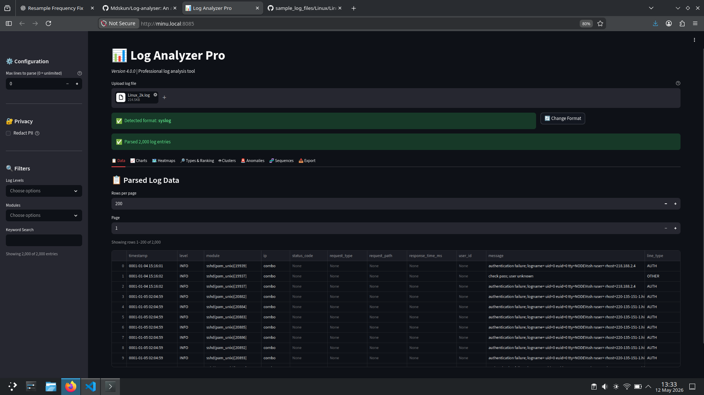
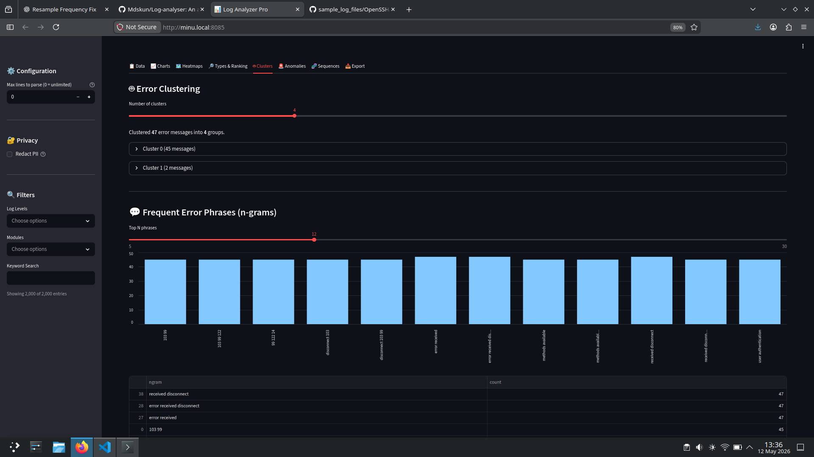
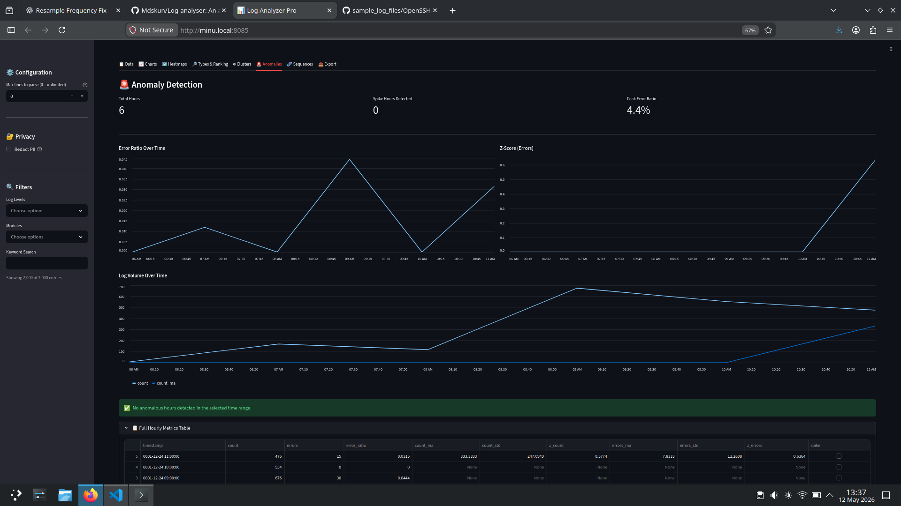

<h1 align="center">
  Log Analyzer Pro
</h1>

<p align="center">
  <strong>🔍 Enterprise-grade log analysis · 🤖 ML-powered insights · 🚀 100MB+ files in seconds</strong>
</p>

<p align="center">
  Stop digging through thousands of log lines manually. Let AI detect anomalies, cluster errors, and surface patterns — all with privacy-first PII redaction.
</p>

<p align="center">
  <a href="https://www.python.org/downloads/"></a>
  <a href="#"></a>
  <a href="#"></a>
  <a href="LICENSE"></a>
</p>

<br>

## 📖 Table of Contents

- [Overview](#-overview)
- [Features](#-features)
- [Demo](#-demo)
- [Tech Stack](#-tech-stack)
- [Requirements](#-requirements)
- [Installation](#-installation)
- [Working](#-working)
- [Project Structure](#-project-structure)
- [Documentation](#-documentation)
- [Contribution](#-contribution)
- [License](#-license)
- [Author](#-author)

---

## 🎯 Overview

### What is Log Analyzer Pro?

A **professional-grade log analysis platform** that combines traditional parsing with machine learning. Upload any log file — Syslog, Apache, JSON, XML — and instantly get statistical insights, anomaly detection, and semantically clustered error messages.

### The Problem

Developers and SRE teams waste hours manually grepping through gigabytes of logs, missing critical patterns, and struggling to correlate errors across distributed systems.

### The Solution

Log Analyzer Pro automates the entire analysis pipeline:
- **Auto-detects** 10+ log formats instantly
- **Redacts PII** (emails, IPs, tokens) before processing
- **Clusters errors** by semantic meaning, not exact strings
- **Detects anomalies** using rolling z-scores
- **Mines sequences** — finds patterns that *precede* failures

### 👥 Who is it for?

| Role | Value |
|------|-------|
| **SRE / DevOps** | Root cause analysis, anomaly detection, spike identification |
| **Backend Engineers** | Debug production issues, analyze error rates by module |
| **Security Analysts** | Redact sensitive data before sharing logs |
| **Data Scientists** | Export clean, structured log data for custom ML |

---

## ✨ Features

<table>
<tr>
<td width="50%">

### 📁 **8+ Format Auto-Detection**
Syslog, Apache (Common/Combined), JSON (Docker/K8s/AWS/GCP), XML Windows Events, custom `[timestamp][level]` — zero configuration.

### 🤖 **ML Clustering**
K-means groups error messages by **semantic similarity** — finds related bugs even when error strings differ.

### 🚨 **Anomaly Detection**
24-hour rolling z-scores catch sudden traffic spikes, error bursts, and latency outliers — with severity ranking.

### 🔐 **Privacy-First Redaction**
Emails, IPv4/IPv6, UUIDs, JWT tokens, AWS/GCP keys — automatic removal before any processing.

</td>
<td width="50%">

### 📊 **8 Interactive Tabs**
Data viewer, charts, heatmaps, ranking, clustering, anomalies, sequence mining, export.

### 🧬 **Sequence Mining**
Discovers event patterns that *precede* errors — “When X happens, Y crashes 73% of the time.”

### 📥 **One-Click Export**
Filtered data → CSV or JSON. Redacted data flows through all exports automatically.

### ⚡ **Streaming I/O**
100 MB files processed in ~38 seconds — never loads entire file into memory.

</td>
</tr>
</table>

---

## 🖼️ Demo
<table>
<td align="left">
  
  <br>
  <em>Interactive dashboards with Altair visualizations</em>
</td>

<td align="center">
  
  <br>
  <em>K-means clustering of similar error messages</em>
</td>

<td align="right">
  
  <br>
  <em>Rolling z-score anomaly detection</em>
</td>
<table>

---

## 🧰 Tech Stack

| Category | Technologies | Purpose |
|----------|--------------|---------|
| **Frontend** | Streamlit | Interactive dashboard UI |
| **Data Processing** | Pandas, NumPy | DataFrame operations, aggregations |
| **ML & Analytics** | scikit-learn (KMeans, TF-IDF), DateTime | Clustering, similarity, time-series |
| **Visualization** | Altair, Streamlit native | Charts, heatmaps, trends |
| **I/O & Performance** | Generators, LRU cache, pre-compiled regex | Streaming parse, memory efficiency |
| **Containerization** | Docker, Docker Compose | One-command deployment |
| **Testing** | pytest, pytest-cov | Unit + integration (80+ tests) |

---

## 📋 Requirements

| Requirement | Version / Spec |
|-------------|----------------|
| **Python** | 3.9 – 3.11 |
| **RAM** | 2 GB minimum (4+ GB for 100MB+ files) |
| **Disk** | 500 MB for dependencies + cache |
| **OS** | Linux, macOS, Windows (WSL2 recommended) |
| **Docker** | 20.10+ (optional) |

---

## ⚡ Installation

### 🐍 Option 1: Local (Recommended for development)

```bash
# Clone the repository
git clone https://github.com/mdskun/Log-analyser.git
cd Log-analyser

# Create virtual environment
python -m venv venv
source venv/bin/activate      # Windows: venv\Scripts\activate

# Install dependencies
pip install -r requirements.txt

# Launch the app
streamlit run app.py
```

Your browser will open to `http://localhost:8501` automatically.

### 🐳 Option 2: Docker (Recommended for production / evaluation)

```bash
# Clone and enter directory
git clone https://github.com/mdskun/Log-analyser.git
cd Log-analyser

# Build and run with Docker Compose
docker-compose up --build
```

Access the app at `http://localhost:8085`

**Single container command:**
```bash
docker build -t log-analyser:latest .
docker run -p 8085:8085 --name log-analyser log-analyser:latest
```

### 🧪 Developer Setup (with tests + linters)

```bash
pip install -e ".[dev]"
pytest                    # run tests
black src/ tests/         # format code
mypy src/                 # type checking
```

---

## ⚙️ Working

### User Flow (3 steps)

```
1. 📂 Upload log file        →   2. ⚙️ Configure (redaction, max lines)   →   3. 📊 Explore 8 analysis tabs
```

### Internal Architecture (Single-pass streaming)

```
┌─────────────┐     ┌─────────────┐     ┌─────────────┐     ┌─────────────┐
│  Log File   │───▶│   Parser    │───▶│  Enrichment │───▶│  Analytics  │
│  (streamed) │     │  Factory    │     │  (PII, UA)  │     │  (ML, Stats)│
└─────────────┘     └─────────────┘     └─────────────┘     └─────────────┘
                           │                    │                    │
                           ▼                    ▼                    ▼
                    Format detection     LRU caching         Clustering
                    (regex on sample)    (zero per-line       Anomalies
                                         overhead)            Sequences
```

**Key design decisions:**
- **Streaming I/O** → Files never fully loaded into memory
- **Pre-compiled regex** → All patterns compiled at import, not per line
- **LRU cache** → `detect_line_type` and `parse_user_agent` results reused
- **Single responsibility** → Parse → Enrich → Analyze → Render (no backward calls)

---

## 📁 Project Structure

```
Log-analyser/
├── app.py                      # Streamlit entry point (UI orchestration)
├── requirements.txt            # Production dependencies
├── setup.py                    # Dev extras (pytest, black, mypy)
├── docker-compose.yml          # Multi-container setup
├── Dockerfile                  # Production container
│
├── src/                        # Core modules (no UI layer imports)
│   ├── parsers/                # Format parsers + factory pattern
│   │   ├── base.py             # Abstract parser interface
│   │   ├── syslog_parser.py    # RFC 3164 / 5424
│   │   ├── apache_parser.py    # Common / Combined / mod_jk
│   │   ├── json_parser.py      # Docker, K8s, CloudWatch, GCP
│   │   └── factory.py          # Auto-detection dispatcher
│   │
│   ├── analytics/              # Statistical & ML modules
│   │   ├── metrics.py          # Error rates, hourly spikes, ranking
│   │   ├── clustering.py       # KMeans + TF-IDF semantic grouping
│   │   ├── anomalies.py        # Rolling z-score detection
│   │   └── sequences.py        # Pattern mining (a priori style)
│   │
│   ├── utils/                  # Helpers (no business logic)
│   │   ├── patterns.py         # 30+ pre-compiled regex (PII, formats)
│   │   ├── redaction.py        # Email, IP, UUID, token removal
│   │   ├── enrichment.py       # User-agent parse, geoip stub
│   │   └── io_utils.py         # Streaming line iterator, format detection
│   │
│   └── ui/                     # Streamlit UI components
│       ├── tabs/               # One file per tab (charts, clusters, etc.)
│       └── format_config.py    # Custom parser configuration UI
│
├── tests/                      # 80+ pytest cases
│   ├── test_parsers.py
│   ├── test_redaction.py
│   ├── test_anomalies.py
│   └── ...
│
├── docs/                       # Full documentation
│   ├── ARCHITECTURE.md         # Data flow, module responsibilities
│   ├── API.md                  # Programmatic usage reference
│   ├── CHANGELOG.md            # Version history (v4.0.0 current)
│   ├── ROADMAP.md              # Planned features
│   └── CONTRIBUTING.md         # PR guidelines
│
└── examples/                   # Sample logs + usage demo
    ├── analyse_programmatically.py
    ├── apache-sample.log
    ├── syslog-sample.log
    └── json-docker.log
```

**Important modules explained:**

| Module | Responsibility | Key Functions |
|--------|---------------|---------------|
| `src/parsers/factory.py` | Auto-detects format from first 50 lines | `detect_format()` |
| `src/analytics/clustering.py` | KMeans on TF-IDF vectors of error messages | `cluster_errors()` |
| `src/analytics/sequences.py` | Finds patterns preceding errors | `mine_sequences()` |
| `src/utils/patterns.py` | 30+ compiled regex patterns | `EMAIL_RE`, `IPV4_RE`, `JWT_RE` |

---

## 📚 Documentation

| Document | Description |
|----------|-------------|
| [ARCHITECTURE.md](docs/ARCHITECTURE.md) | Complete system design — flow diagram, module boundaries, extension guide |
| [API.md](docs/API.md) | Programmatic usage — parse, enrich, analyze from Python |
| [CHANGELOG.md](docs/CHANGELOG.md) | Version history (v4.0.0 with Docker, sequence mining, redaction) |
| [ROADMAP.md](docs/ROADMAP.md) | Future features — real-time tail, multi-file correlation |
| [CONTRIBUTING.md](docs/CONTRIBUTING.md) | PR guidelines, coding standards (Black, mypy, pytest) |

**Architecture highlight:** The project follows a **strict unidirectional data flow** — Parser → Enrichment → Analytics → UI. No module imports `app.py` or any UI layer. This makes testing isolated and adding new parsers/analytics trivial.

---

## 🤝 Contribution

We welcome contributions! Log Analyzer Pro is designed to be easily extensible.

### Quick start for contributors

```bash
# Fork & clone your fork
git clone https://github.com/YOUR_USERNAME/Log-analyser.git
cd Log-analyser

# Install dev dependencies
pip install -e ".[dev]"

# Create a branch
git checkout -b feature/your-awesome-idea
```

### Adding a new parser (10-minute task)

1. Create `src/parsers/your_format_parser.py`
2. Implement a function that takes `Iterator[str]` → returns `pd.DataFrame`
3. Register it: `LogParser.register_parser("my_format", my_func)`
4. Write tests in `tests/test_parsers.py`

### Pull request checklist

- [ ] `pytest` passes (80+ tests)
- [ ] `black src/ tests/` applied
- [ ] `mypy src/` shows no errors
- [ ] Update `docs/CHANGELOG.md` under “Unreleased”
- [ ] Add yourself to `AUTHORS.md` (optional)

See [CONTRIBUTING.md](docs/CONTRIBUTING.md) for detailed guidelines.

---

## 📄 License

Distributed under the **MIT License**. See [LICENSE](LICENSE) for more information.

You can use, modify, and distribute this software commercially or privately — attribution appreciated but not required.

---

## 👤 Author

**Manthan D Soni**

[](https://github.com/mdskun)
[](mailto:manthandsoni@gmail.com)

---

<p align="center">
  <b>Built with</b> ❤️ · Streamlit · Pandas · scikit-learn · Altair
  <br>
  <a href="https://github.com/mdskun/Log-analyser">⭐ Star this repo on GitHub — it helps others discover the project</a>
</p>

<p align="center">
  <i>“Stop grepping. Start understanding.”</i>
</p>
```
